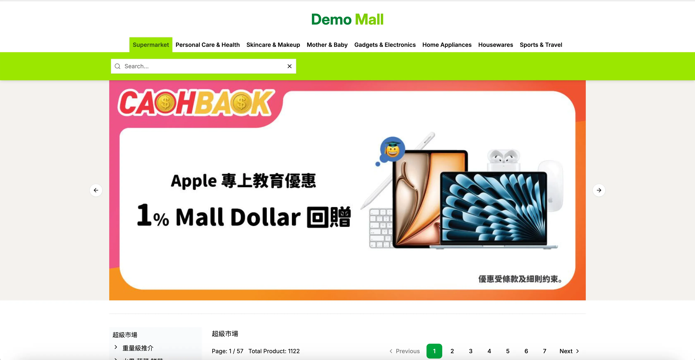
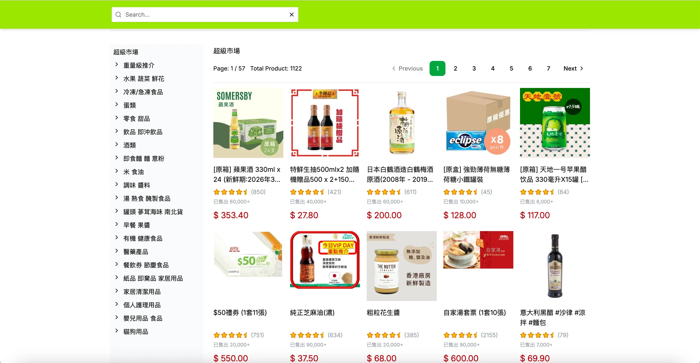

# 🛍️ E-shop project

A demo project built using React.js, React Router v7 (Remix.js) and SQLite..

## React Router Features

- 🚀 Server-side rendering
- ⚡️ Hot Module Replacement (HMR)
- 📦 Asset bundling and optimization
- 🔄 Data loading and mutations
- 🔒 TypeScript by default
- 🎉 TailwindCSS for styling
- 📖 [React Router docs](https://reactrouter.com/)

## Screenshots

#### Screenshot 1



#### Screenshot 2



## Getting Started

### Installation

Install the dependencies:

```bash
pnpm install
```

or

```bash
npm install
```

### Generate Prisma Client

[Prisma Docs](https://www.prisma.io/docs/orm/prisma-client/setup-and-configuration/generating-prisma-client)

```bash
pnpm db:generate
```

or

```bash
npm run db:generate
```

### Development

Start the development server with HMR:

```bash
pnpm dev
```

or

```bash
npm run dev
```

The application will be available at `http://localhost:5173`.

## Building for Production

Create a production build:

```bash
pnpm build
```

or

```bash
npm run build
```

---

Built with ❤️ using React Router.
